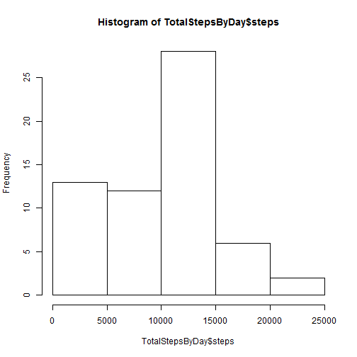
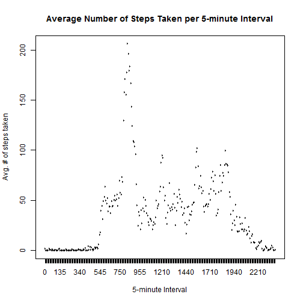
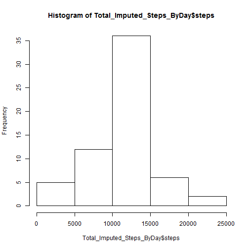
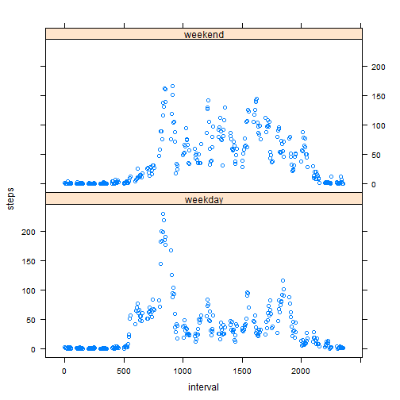

# Reproducible Research: Peer Assessment 1


## A. Introduction

It is now possible to collect a large amount of data about personal movement using activity monitoring devices such as a Fitbit, Nike Fuelband, or Jawbone Up. These type of devices are part of the "quantified self" movement - a group of enthusiasts who take measurements about themselves regularly to improve their health, to find patterns in their behavior, or because they are tech geeks. But these data remain under-utilized both because the raw data are hard to obtain and there is a lack of statistical methods and software for processing and interpreting the data.

This assignment makes use of data from a personal activity monitoring device. This device collects data at 5 minute intervals through out the day. The data consists of two months of data from an anonymous individual collected during the months of October and November, 2012 and include the number of steps taken in 5 minute intervals each day.

## B. Data

The data for this assignment can be downloaded from the course web site:

    Dataset: Activity monitoring data [52K]

The variables included in this dataset are:

    steps: Number of steps taking in a 5-minute interval (missing values are coded as NA)

    date: The date on which the measurement was taken in YYYY-MM-DD format

    interval: Identifier for the 5-minute interval in which measurement was taken

The dataset is stored in a comma-separated-value (CSV) file and there are a total of 17,568 observations in this dataset.

## C. Loading and preprocessing the data

1. Download Data
2. Unzip the Data and Read File


```r
temp <- tempfile()
download.file("http://d396qusza40orc.cloudfront.net/repdata%2Fdata%2Factivity.zip",temp)
activity <- read.csv(unz(temp, "activity.csv"))
```

## D. What is mean total number of steps taken per day?

1.  Aggregate sum of steps by day


```r
TotalStepsByDay<-aggregate(activity$steps, list(activity$date) , sum , na.rm=TRUE)
colnames(TotalStepsByDay)<-c("date","steps")
```

2.  Histogram of avg steps per day


```r
hist(TotalStepsByDay$steps)
```

 

3.  Calculate the mean and median steps per day

```r
  #Calculate the Mean and Median Steps Per Day
  mean(TotalStepsByDay$steps,na.rm=TRUE)
```

```
## [1] 9354
```

```r
  median(TotalStepsByDay$steps,na.rm=TRUE)
```

```
## [1] 10395
```

## E. What is the average daily activity pattern?

1.  Aggregate the mean number of steps by interval


```r
  AvgStepsByInterval<-aggregate(activity$steps, list(as.factor(activity$interval)) , mean , na.rm=TRUE)
  colnames(AvgStepsByInterval)<-c("interval","steps")
```

2.  Time series plot of the 5-minute interval (x-axis) and the average number of steps taken, averaged across all days (y-axis)
  

```r
plot(y=AvgStepsByInterval$steps
       ,x=AvgStepsByInterval$interval
       ,type="l"
       ,xlab="5-minute Interval"
       ,ylab="Avg. # of steps taken"
       ,col="red"
       ,main="Average Number of Steps Taken per 5-minute Interval"
  )
```

 

3.  Which 5-minute interval, on average across all days, contains the maximum number of steps?  835


```r
  AvgStepsByInterval[which(AvgStepsByInterval$steps==max(AvgStepsByInterval$steps)),"interval"]
```

```
## [1] 835
## 288 Levels: 0 5 10 15 20 25 30 35 40 45 50 55 100 105 110 115 120 ... 2355
```

## F. Imputing missing values

1.  Calculate and report total number of missing values (NA)


```r
  nrow(activity[complete.cases(activity)==FALSE,])
```

```
## [1] 2304
```

2.  Impute:  Strategy will use the mean for the 5-minute interval in which the missing value appears


```r
  library(plyr)
  impute.mean <- function(x) replace(x, is.na(x), mean(x, na.rm = TRUE))
  activity_imputed <- ddply(activity, ~ interval
                            , transform
                            , steps = impute.mean(steps)
  )
  activity_imputed<-activity_imputed[order(activity_imputed$date,activity_imputed$interval), ]
```

3.  Make a histogram of the total number of steps taken each day


```r
  Total_Imputed_Steps_ByDay<-aggregate(activity_imputed$steps, list(activity_imputed$date) , sum , na.rm=TRUE)
  colnames(Total_Imputed_Steps_ByDay)<-c("date","steps")

  hist(Total_Imputed_Steps_ByDay$steps)
```

 

4.  Calculate and report the mean and median total number of steps taken per day. 

```r
  mean(Total_Imputed_Steps_ByDay$steps,na.rm=TRUE)
```

```
## [1] 10766
```

```r
  median(Total_Imputed_Steps_ByDay$steps,na.rm=TRUE)
```

```
## [1] 10766
```
  
5.  **Conclusion:**  Do these values differ from the estimates from the first part of the assignment? 
  
  The mean increased from 9354 (NAs included) to 10766 (imputed)
  The median increased from 10395 (NAs included) to 10766 (imputed)
  
  This is to be expected because originally the sums were ignoring NA values.
  Now that they have been imputed they are included in the sum which increases it's overall value.
  


## G. Are there differences in activity patterns between weekdays and weekends?

1.  Create a new factor variable in the dataset with two levels - "weekday" and "weekend" indicating whether a given date is a weekday or weekend day.


```r
activity_imputed$weekpart <- ifelse(weekdays(as.Date(activity_imputed$date)) %in% c("Saturday","Sunday"),"weekend", "weekday")
```
  
2.  Make a panel plot containing a time series plot of the 5-minute interval (x-axis) and the average number of steps taken, averaged across all weekday days or weekend days (y-axis).

```r
  library(lattice)
  WeekPart_Avg_Steps<-aggregate(activity_imputed$steps, list(activity_imputed$weekpart,activity_imputed$interval) , mean , na.rm=TRUE)
  colnames(WeekPart_Avg_Steps)<-c("weekpart","interval","steps")

  xyplot(steps ~ interval | weekpart, WeekPart_Avg_Steps, layout=c(1,2))
```

 

3.  **Conclusion**

Yes, visually you can see a number of trends.  For example:

* Weekdays have more activity in the earlier 5-minute intervals than the activity on weekends
* Conversely, Weekends have more activity in the later 5-minute intervals than the activity on weekdays
* Weekdays also have a higher number of average steps around the 800 5-minute intervals
* Without the need for statistical analysis you can see there is greater variability in average steps on weekends
* Weekdays have peaks which likely correspond to morning commute, lunch, and end of day.
